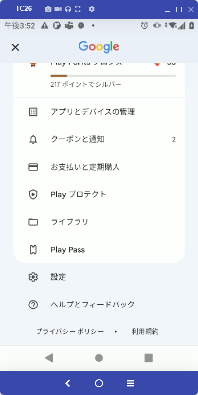
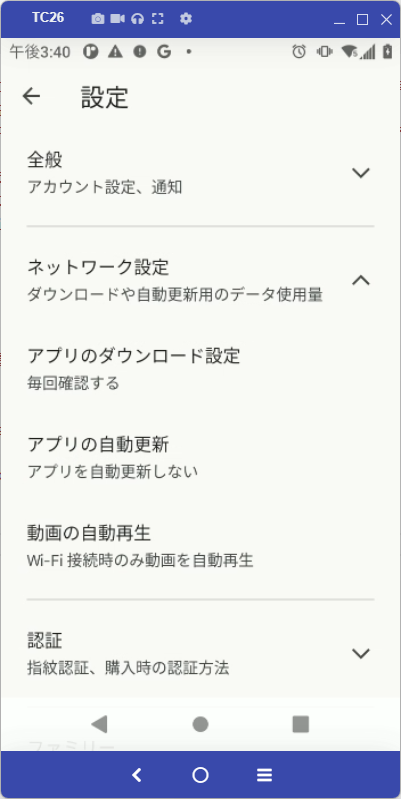
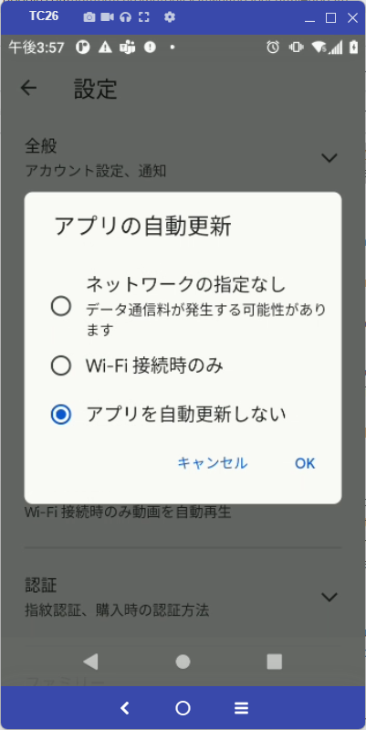

### AndroidのGoogle Chromeの自動アップデートを回避する方法

 

Android がデフォルト設定の場合、Chromeは最新バージョンに自動更新されてしまいます。これは個人ユースではセキュリティ性を保つために非常に便利な機能ですが、企業ユースの場合は動作アプリとの兼ね合いもあり、バージョンを固定としたい場合があります。

※ Google Playの更新により、固定化できなくなる可能性がありますので、ご利用の環境で動作確認の上、ご利用ください。

公式資料によるとChrome はGoogle Playストアにてバージョンを管理しているとの記載があります。よって、自動更新停止の設定もストア側にて実施する必要があります。

 

https://www.google.com/intl/en/chrome/privacy/whitepaper.html#update

    Unlike the desktop versions of Chrome, the delivery and management of updates for mobile versions of Chrome are managed through the app stores for Android and iOS. Mobile versions of Chrome utilize the servers described above for counting active installations and for user-initiated checks for updates.

 

### # 設定手順 (A11の場合)

Google Play 起動 > [アカウントアイコン（右上）]選択 > [設定] > [ネットワーク設定] > [アプリの自動更新] > "アプリを自動更しない"を選択

